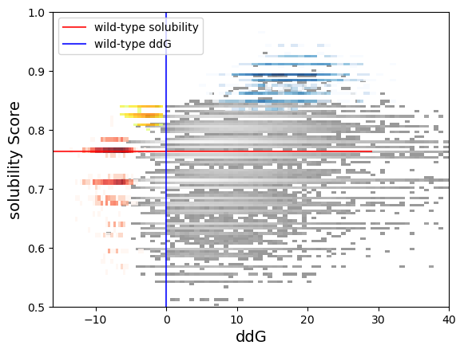

# KAUST-CS283-Course-Project

# Introduction
The course project of CS283 Deep Generative Modeling at KAUST. The modification of GENhance for thermostability and solubility co-optimization.

The results of co-optimization is visualized below, where the joint property distribution of the generated data, where red represents the distribution of the generated sequences by the thermostability model, blue represents the distribution of the generated sequences by the solubility optimization model, and the yellow represents the distribution of the generated sequences by the co-optimization optimization model.
<div align=center>
    
    <div align=center> Figure 1. The co-optimizaiton visualization.</div>
</div>

# How to run the project
To reproduce the results may takes up you much time at least two days as the pipline a little bit complex and can not be simplified. If you meet some raised errors, it is probably becuase of the worng path settings since there are many path parameters and it is easy to make mistakes. Each step uses the relevant paths or data from the previouse setp, please make sure the settings of each step are consistent, for example, the path of the model checkpoints in the training step and generation step.

## Dependency
1. The yaml file for the anaconda environment is stored on ```./genhance/temp/genhance.yaml```. Create the anaconda virtual encironemtn and install dependencies: ```conda env create -f ./genhance/temp/genhance.yaml```.
2. Install **FoldX 5.0** and **Protein-Sol**.

## Training
1. You are required more than 40 GB GPU memory to run as I trained the model using at least 1 A100-80GB or 2 A100-40GB and the memory size depends on the used layer number of the encoder and decoder (6 + 6 by default). Larger model usually gives better performance under the same setting.
2. All related preprossed data are stored in ```./genhance/data/```.
3. Make sure you download the ProtT5 model from https://huggingface.co/Rostlab/prot_t5_xl_uniref50.
4. Modify all path parameters in the script file '''./genhance/ACE2/training_scripts/train_controlled_gen_cooptim.sh''', for example, Set the ```pretrained_dir``` and ```cache_dir``` in the script file  with your T5 model path. 
5. Run the following commands in shell: ```nohup sh ./genhance/ACE2/training_scripts/train_controlled_gen_cooptim.sh > ./run.log 2>&1 &```
7. The default setting is for the thermostability and solubility co-optimization. Also, you can train the model for thermostability or solubility optimization and modify the configuration by commenting or uncommenting the corresponding scripts in ```./genhance/ACE2/training_scripts/train_controlled_gen_cooptim.sh```.
8. The training takes up approximately 24 hours on A100.


## Generation
1. Make sure you run this step after the training finished.
2. Modify all path parameters in the script file '''./genhance/ACE2/generation_scripts/generate_clspool_congen.sh''', for example, Set the ```gen_pretrained_dir``` with your path storing the checkpoint model. 
3. Run the following commands in shell: ```sh /home/hew/python/genhance/ACE2/generation_scripts/generate_clspool_congen.sh```.
4. The default setting is for the thermostability and solubility co-optimization. Also, you can train the model for thermostability or solubility optimization and modify the configuration by commenting or uncommenting the corresponding scripts in ```./genhance/ACE2/generation_scripts/generate_clspool_congen.sh```
5. The generation process takes up approximately 10 hours on A100.


## Prepare Sequences for FoldX and Protein-Sol
1. Open the jupyter notebook ```./genhance/ACE2/Prepare Sequences for FoldX.ipynb```
2. Modity the corresponding variables, for example, generation path, and follow the instruction to filter out those sequences can not meet the requirements.


## Evaluation
1. The evaluation jupyter notebooks are stored in ```./genhance/ACE2/evaluation/```
2. Open the corresponding jupyter notebooks, modify the relevant paths, for example, the excutable path of FoldX 5.0 and follow the instructions.
3. It takes up approximately average 4 minitues (depedends on the number of mutations) for FoldX to compute the ddG value of one sequence.
4. It takes up several minites to evaluate 1000 sequences using Protein-Sol.


